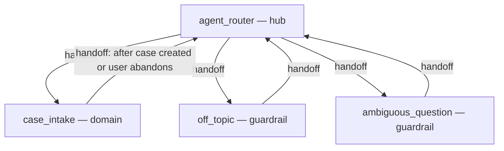

# Agent Spec — CRM_Support_Agent (v1 shell)

**Status:** DRAFT — awaiting approval before any code generation
**Date:** 2026-07-04 · **Target org:** KJDEV · **Governing doc:** ClaudeCode_WorldClass_Agent_Standard_v2.md

## Purpose & Scope

Employee-facing CRM Support agent for internal Salesforce users. **v1 is the shell only**: routing, guardrails, and the fallback/intake capability — a structured case-creation path that satisfies Standard v2 §2 ("ambiguous utterances route to structured intake, not to a guess") and §4 (agent-created cases carry the origin marker and arrive complete). Domain topics (first: Opportunity Stages) are added as separate builds once the shell is proven.

## Configuration

- **Agent type:** `AgentforceEmployeeAgent` (internal users in Salesforce; no Messaging channel)
- **Default agent user:** N/A — employee agent (config block must NOT contain `default_agent_user`)
- **Permissions:** end-user access configured post-activation per Agent Access Guide; runtime users need FLS on `Case.Agent_Created__c` (permission set `CRM_Support_Agent_Program`, already in repo)

## Behavioral Intent

1. The agent never invents org behaviour. In v1 the shell has **no domain knowledge**, so every substantive question routes to intake — this is correct v1 behaviour, not a defect.
2. Every case the agent creates must arrive complete: what the user was doing, exact error text (if any), record link, business reason. Escalation-quality KPI depends on this.
3. Every case the agent creates is stamped `Agent_Created__c = true` (KPI origin marker) and record-typed **CRM Support**.
4. Case creation is confirmation-gated: the agent summarises the intake and asks the user to confirm before calling the action.
5. Kill switch (Standard v2 §3): the case-creation Apex checks `Application_Settings__c.Disable_CRM_Support_Agent__c` **server-side** and refuses the write when set, returning a `blocked` flag; the agent then explains it is in read-only mode and gives the manual case-raising route. Server-side enforcement is deterministic and survives any prompt manipulation.

## Subagent Map

## Subagents

### `agent_router` (hub, start_agent)
Greets, explains capability honestly ("I can raise a well-formed support case for you; topic answers are coming"), routes. Defensive instruction for same-turn arrivals from spokes.

### `case_intake` (domain)
Collects the four intake fields conversationally (missing error text is allowed only if the user states there was no error), summarises, asks for explicit confirmation, then calls `create_support_case`. On success: relay case number, transition back to router. On `blocked = true`: explain read-only mode, point to the manual case channel, do not retry.

### `off_topic` / `ambiguous_question` (guardrails)
Standard template guardrails, kept per skill guidance.

## Actions & Backing Logic

### `create_support_case`
- **Backing:** NEEDS STUB → invocable Apex `AgentCaseCreator` (new class; nothing suitable exists — repo scan found no invocable Apex for case creation)
- **Target:** `apex://AgentCaseCreator`
- **Inputs:** `subject` (string, req), `description` (string, req — what the user was changing + business reason), `errorText` (string), `recordLink` (string)
- **Outputs:**
  | Output | Type | Visible to user? |
  |---|---|---|
  | `caseNumber` | string | Yes (`filter_from_agent: False`) |
  | `blocked` | boolean | No (`True`) — routing signal |
  | `message` | string | Yes — human-readable outcome/refusal |
- **Behaviour:** if `Application_Settings__c.getInstance().Disable_CRM_Support_Agent__c` → return `blocked=true`, no DML. Else insert Case: RecordType "CRM Support", `Agent_Created__c=true`, `Origin='Web'`, Subject/Description composed from inputs (error text and record link embedded in Description). Bulkified (list-based invocable), one test class with kill-switch-on, kill-switch-off, and bulk (251) paths.

## Variables

None in v1. Confirmation is instruction-level (see Gating); no state must persist across subagents.

## Gating Logic

- **Kill switch — deterministic, server-side** in `AgentCaseCreator`. Chosen over an agent-side `available when` because Agent Script cannot read a custom setting directly, and the Standard requires the gate to hold even if the LLM misbehaves. The agent-side handling of `blocked` is presentational only.
- **Confirmation before create — subjective** (instruction: summarise + explicit user "yes" before calling the action). Accepted for v1 because the action's blast radius is one support case; revisit to a deterministic two-step gate if escalation-quality reviews show premature creation.
- **Action-loop prevention:** post-action instructions name output fields (`caseNumber`, `message`), forbid re-calling, forbid `show_command`; success path transitions back to `agent_router`.

## Out of scope for v1 (explicit)

- Knowledge-grounded answering (comes with the Opportunity Stages topic build, after corpus testing)
- Outlook/Teams reachability (Standard §6 — later phase)
- Proactive nudges
- Any data-changing action beyond case creation

## Definition-of-done hooks

- Case origin marker → KPI reports (Standard v2 §4) — reportable from day one
- Kill-switch drill (DoD #9) — testable in preview by flipping the setting in KJDEV
- Utterance corpus routing tests apply once the Opportunity Stages topic is added; for the shell, preview tests cover: intake happy path, confirmation decline, kill-switch-on refusal, off-topic redirect
